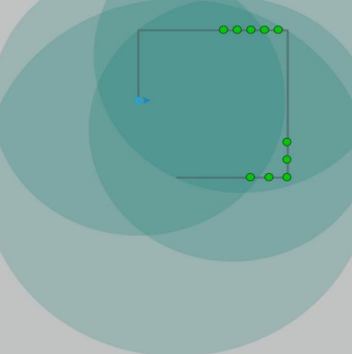
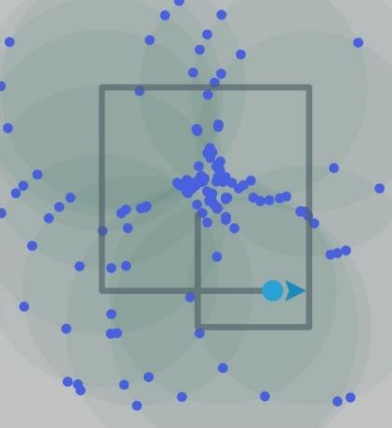
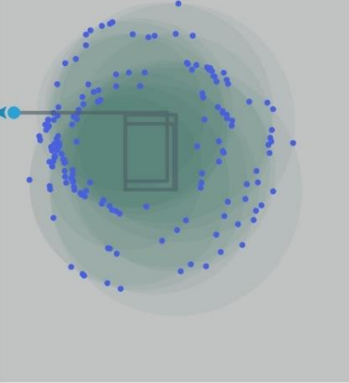
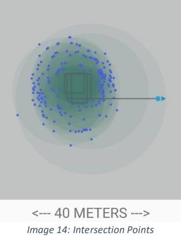
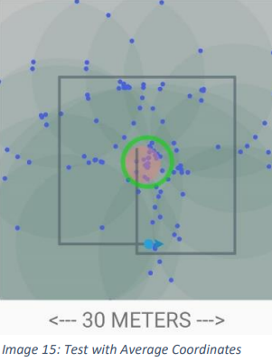
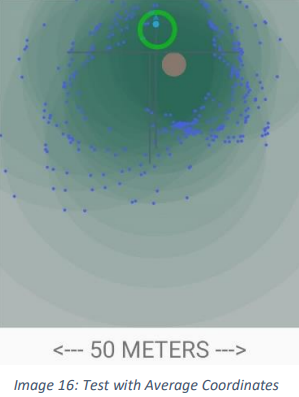
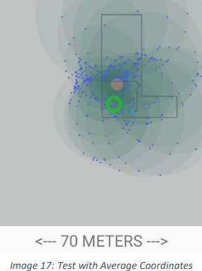

# beacon-positioning-app

## **INTRODUCTION**
Indoor positioning is still a developing field and BLE (Bluetooth Low Energy) beacons can be the key points of this rising technology. GPS is useful for outdoor locations but we need other methods for indoor positioning. Bluetooth technology can answer to these rising needs on indoor positioning but there are limitations. These limitations are from the variations of signal strengths, objects blocking signals, short distance ranges of Bluetooth signals. These are some of the limitations which makes indoor positioning more challenging.

Nonetheless, there are solutions that improves the accuracy of positioning such as triangulation. BLE beacons can be considered as reference points to track an asset (mostly a 
mobile device). More the reference points, better the position accuracy of an asset. In this project, a reverse engineering method will be discussed. Which is “Can we apply the same principle to track and find locations of beacons using our mobile devices?”.

## **PROBLEM DEFINITION**
Indoor positioning is usually applied to scan and track the Bluetooth assets within an environment. Beacons are used in this manner as reference points estimating the distance 
from each beacon for a certain asset. In this project, this concept is used to do the opposite which is scanning for beacon positions in an establishment. This can also be called as reverse engineering. 

## **PROCEDURE**
To scan and work with beacons, an open source library will be added to the project which is Android Beacon Library. In the gradle scripts of the project, adding the android beacon 
implementation in the dependencies will synchronize the project and will add the library. As observed on the image below, green circles are added on the image to simulate measurement positions. At that points, distance estimations are done for a beacon in the area. Initially, every one of these green points create beacon circles but these circles and corresponding positions are averaged to create one reference point at that position.

Every time a circle is created from a virtual reference point. All the values about the circle is recorded that are center position and radius. These are all the information needed to draw circles. Every time a new circle is recorded, the code checks every one of the previous circles to find intersection points. On the images below, intersection points of the circles are drawn. On the image 12, a beacon is placed at the center and a rectangular movement is done around the beacon (having mobile device on hand) and there is an accumulation of intersection points on the center position. On the image 13, a beacon is placed to the left and a rectangular movement is done. This time the beacon was outside to the left of the rectangular path. There is an accumulation observed on the left. Opposite case for the image 14 where a beacon is placed outside to the right of the 
rectangular path. There is an accumulation on the right but slightly less compared to the other ones.

   

For the test cases below, green circles are added to show real positions of beacons. While carrying the mobile device and scanning for the beacon to create circles, red circle is updated every time a circle added from a virtual reference point. On the image 15, a beacon is placed on the center similar to the cases before and the red circle is at the same position with the green circle that is an accurate estimation for average coordinates. On the image 16, a path that looks like a T shape is travelled and a beacon is placed at top point of T shaped area as shown by the green circle. Red circle was far from the green circle by 3-4 meters. On the image 17, a beacon is placed over 2 meters from ground at the shown position and the estimated position was again shifted by 3-5 meters denoting a position above the green circle.

   

## **REFERENCES**
https://kontakt.io/what-is-a-beacon/
https://www.novelbits.io/overview-bluetooth-beacons-part-1/
https://altbeacon.github.io/android-beacon-library/distance-calculations.html
https://www.scientificamerican.com/article/bring-science-home-estimating-height-walk/#:~:text=On%20average%2C%20adults%20have%20a,from%20about%200.41%20to%
https://stackoverflow.com/questions/3349125/circle-circle-intersection-points

